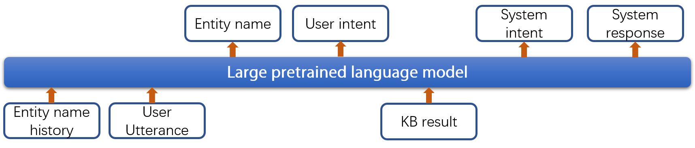

# JSA-KRTOD
This repository contains the baseline code for SereTOD Track2 and the implementation of JSA-KRTOD. For some reasons, the original dataset is not available for public now, and the code is open-sourced for reference. If you are interesting in reproducing the code, contact the author, and the original dataset can be gained under some condition.
## Requirement
After you create an environment with `python 3.7`, the following commands are recommended to install the required packages
* pip install torch==1.7.1+cu110
* pip install transformers==4.3.0
* pip install nltk
* pip install tensorboard
* pip install tqdm
## Data Preprocessing
First, you need to put raw data in `data` directory and rename it to `all_data.json`, then run
```
python preprocess.py
```
This script basically includes the following steps: 
1. Reconstruct the data so that users speak before the customer service in every turn;
2. Normalize the data;
3. Extract the user goal and local KB for every dialog
## Baseline for SereTOD Track2
### Training
In this baseline, we divide the dialog system into several subtasks. For every dialog turn, we need to:
* predict the entity name mentioned or referred to by the user 
* predict the user intent
* query local KB using the predicted user intent
* predict system intent
* predict system response

We maintain a list of entity names (entity name history), which are mentioned by the user in previous turns. The entity name history and user utterance are fed into the model as the conditioning input to complete the above subtasks. 
Similar to [Liu et al.,2022](https://arxiv.org/abs/2204.06452), we employ a Markovian generative architecture (MGA) based on [Chinese GPT-2](https://huggingface.co/uer/gpt2-chinese-cluecorpussmall) to implement the dialog system, whose structure overview is as follows.


During training, the labeled data is splited into training set, validation set and test set with 8:1:1 ratio. You can train the dialog system with all labeled training data
```
bash train.sh $DEVICE
```
`$DEVICE` can be "cpu" or GPU such as "cuda:0". 
### Testing
Only local KB and dialog history are used in testing. You can perform end-to-end evaluation on the test set
```
bash test.sh $DEVICE $MODEL_PATH
```
The results of the baseline model are: 
   - P/R/F1 for user intent: 0.666/0.624/0.644
   - P/R/F1 for system intent: 0.614/0.534/0.571
   - BLEU-4 score: 4.17
   - Success rate: 0.315

## JSA-KRTOD
### Training
### Supervised training using KRTOD:
You can train the generation model with: 
```
bash shell_scripts/train_new.sh $GPU
```
You can change other parameters such as batch size and learning rate in this `.sh` file. For instance, if your GPU has enough memory, you can increase the batch size and decrease the gradient accumulation steps.

*Note: Due to OS differences, if there is a problem running the `.sh` file, please execute the following command first*

```
dos2unix ${sh_file_name}
```

You can train the retrieval model with: 
```
bash shell_scripts/train_retrieve.sh $GPU
```

To train the inference model, run
```
bash shell_scripts/train_post.sh.sh $GPU
```

### Semi-supervised training
After supervised pre-training of the generative model and inference model, you can run JSA learning.
```
bash shell_scripts/train_jsa_turn.sh 0,1
```
The hyperparameter RATIO in the get_unsup func in reader.py controls the number of unlabeled data used. Use RATIO=9 to use all unlabeled data. To be refined in the next version.

## Evaluation 
To test the performance of your model:
```
bash test.sh $GPU $path
```
## Checkpoint
Our models and results are stored, and we can provide the checkpoints and results if needed.  

Once you have these checkpoints to folder `experiments`, and change the `path` of `test.sh`, then you can get our results in paper
